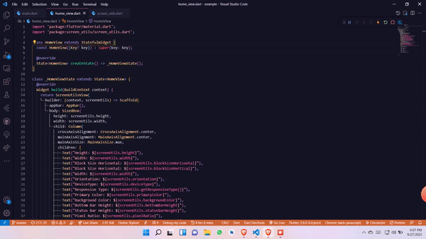

## Features

- Get Device Type
- Get Responsive Type
- Default Text Styles
- Easier to get color schemes and all styles

## Getting started

1. Add this package to your package's `pubspec.yaml` file as described
   on the installation tab

2. Import the libraries

   ```dart
   import 'package:screenutils/screenutils.dart';
   ```

## Usage

You can use it in two ways

- By declaring a separate variable

```dart
ScreenUtils screenUtils = ScreenUtils.init(context);
```

- Or by using a view

```dart

class ExampleView extends StatelessWidget {
  const ExampleView({Key? key}) : super(key: key);

  @override
  Widget build(BuildContext context) {
    return ScreenUtilsView(
      builder: (context, screenUtils) => Scaffold(
        appBar: AppBar(),
        body: SizedBox(
          height: screenUtils.height,
          width: screenUtils.width,
          child: Column(
            crossAxisAlignment: CrossAxisAlignment.center,
            mainAxisAlignment: MainAxisAlignment.center,
            mainAxisSize: MainAxisSize.max,
            children: [
              Text("Height: ${screenUtils.height}"),
              Text("Width: ${screenUtils.width}"),
              Text("Block Size Horizontal: ${screenUtils.blockSizeHorizontal}"),
              Text("Block Size Horizontal: ${screenUtils.blockSizeVertical}"),
              Text("Width: ${screenUtils.width}"),
              Text("Orientation: ${screenUtils.orientation}"),
              Text("DeviceType: ${screenUtils.deviceType}"),
              Text("Responsive Type: ${screenUtils.getResponsiveType()}"),
              Text("Primary Color: ${screenUtils.primaryColor}"),
              Text("Background Color: ${screenUtils.backgroundColor}"),
              Text("Bottom Bar Height: ${screenUtils.bottomBarHeight}"),
              Text("Status Bar Height: ${screenUtils.statusBarHeight}"),
              Text("Pixel Ratio: ${screenUtils.pixelRatio}"),
              Text("Text Scale Factor: ${screenUtils.textScaleFactor}"),
              Text("Duration Ago is:" +
                  DateTimeUtils.timeAgoSinceDate(
                      date: DateTime.now().subtract(const Duration(days: 20)))),
              Text("Date is: ${DateTimeUtils.getDate()}"),
              Text("Month is: ${DateTimeUtils.getMonth()}"),
              Text("Short Month is: ${DateTimeUtils.getMonth(isShort: true)}"),
              Text("Time is: ${DateTimeUtils.getTime()}"),
              Text("Week Day is: ${DateTimeUtils.getWeekDay()}"),
              Text("Whole Date is: ${DateTimeUtils.getWholeDate()}"),
              Text(
                  "Whole Date With Time is: ${DateTimeUtils.getWholeDate(isIncludeTime: true)}"),
              Text(
                "Headline Text Style",
                style: screenUtils.headline,
              ),
              Text(
                "Title Text Style",
                style: screenUtils.title,
              ),
              Text(
                "Body Text Style",
                style: screenUtils.body,
              ),
              Text(
                "Button Text Style",
                style: screenUtils.buttonTextStyle,
              ),
            ],
          ),
        ),
      ),
    );
  }
}
```

## Demo




## Additional information

- Change title of page and its primary color
- Use it for faster developement
- Access Theme data faster
